<picture> <source media="(prefers-color-scheme: dark)" srcset="dark.svg"> <source media="(prefers-color-scheme: light)" srcset="light.svg">  </picture> This auto-switches the banner based on the visitor's GitHub theme.
